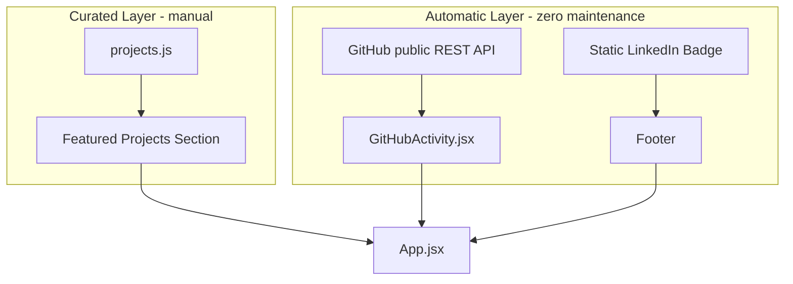

# Long-term roadmap: data engineering portfolio

Goal: keep the portfolio concentrated on Rithvik's actual data engineering work, and keep it fresh as he pushes code to GitHub and posts on LinkedIn — with minimal manual upkeep.

This is a planning document. Phases are not yet implemented; each one lists concrete file-level actions for a future session (use `portfolio-content` for Phase 1/3 content edits, `portfolio-dev` for anything touching build/deploy).

## Guiding principle

Two layers of content, so narrative control and freshness don't conflict:

- **Curated layer** (manual, intentional) — `src/data/projects.js`. He edits this only when he wants to promote a specific flagship project.
- **Automatic layer** (zero maintenance) — a live GitHub feed that reflects whatever he last pushed, with no edits required.

LinkedIn has no free public API for post feeds, so it gets a lightweight, static treatment (a follow link/badge) rather than a synced feed.

No existing projects are removed. All six current entries in `projects.js` stay; only their `featured` flag / ordering may change.

## Phase 1 — Content re-prioritization (curated layer)

- Re-rank `featured` flags / array order in [src/data/projects.js](src/data/projects.js) so pipeline, cloud, and orchestration work leads, ahead of Excel/Tableau-only pieces.
- Cross-check [src/components/Hero.jsx](src/components/Hero.jsx) tagline and [src/components/About.jsx](src/components/About.jsx) copy/proficiency bars against what's actually featured — adjust only if they drift from reality; do not invent new claims or metrics not already stated in the repo.
- No deletions. Current entries: `Python Data Engineering Suite`, `Advanced SQL Data Processing`, `Enterprise Excel Analytics Solutions`, `Marketing Campaign Analytics Platform`, `COVID-19 Data Intelligence System`, `Sales Performance Analytics Dashboard`.

## Phase 2 — "Recent GitHub Activity" auto-feed

New component: `src/components/GitHubActivity.jsx`, mounted in [src/App.jsx](src/App.jsx) between `Projects` and `Contact`.

Data source — GitHub's public REST API, no auth required for public data:

- `GET https://api.github.com/users/RithvikPanchumarthi/repos?sort=pushed&per_page=6` — most recently pushed repos.
- Optionally `GET https://api.github.com/users/RithvikPanchumarthi/events/public` — a commit/push activity timeline.

Display per item: repo name, description, primary language, last-pushed date, link out. Style consistently with `Projects.jsx` cards, respecting dark mode via `src/utils/themeConfig.js`.

Operational notes:

- Unauthenticated GitHub API rate limit is 60 requests/hour per IP — cache responses client-side (e.g. `sessionStorage`, ~1 hour TTL) to avoid hammering the API on repeat visits.
- This section requires no manual edits — it reflects whatever he last pushed automatically.

## Phase 3 — LinkedIn visibility (lightweight)

- Keep the existing icon links in [src/components/Header.jsx](src/components/Header.jsx) and [src/components/Contact.jsx](src/components/Contact.jsx) as-is — already correct.
- Add a small, static "Follow me on LinkedIn for data engineering updates" callout/badge — e.g. near the GitHub Activity section or in the [src/App.jsx](src/App.jsx) footer — linking to `https://www.linkedin.com/in/rithvikpanchumarthi/`.
- No API integration, scraping, or scheduled sync for LinkedIn.

## Phase 4 — Low-maintenance freshness loop

- Ongoing cadence for him: only touch `projects.js` (curated layer) when promoting a new flagship project. GitHub Activity and the LinkedIn badge require zero maintenance.
- Once Phases 1–3 are implemented, log the change in [memory.md](memory.md) and clear the corresponding "Open next steps" items.

## Content layers after roadmap execution

## Files touched by future execution

| File | Change |
| --- | --- |
| [src/data/projects.js](src/data/projects.js) | Reorder / re-flag featured projects |
| [src/components/Hero.jsx](src/components/Hero.jsx) | Copy check only |
| [src/components/About.jsx](src/components/About.jsx) | Copy check only |
| `src/components/GitHubActivity.jsx` | New — live GitHub feed component |
| [src/App.jsx](src/App.jsx) | Mount new component + LinkedIn badge |
| [customization.md](customization.md) | Document "Recent Activity" section and how it differs from curated projects |
| [memory.md](memory.md) | Session log entry once implemented |

## Out of scope

- No LinkedIn API/OAuth integration or automated post syncing.
- No removal of existing projects.
- Phases 2–4 are specs only until a future session implements them.
